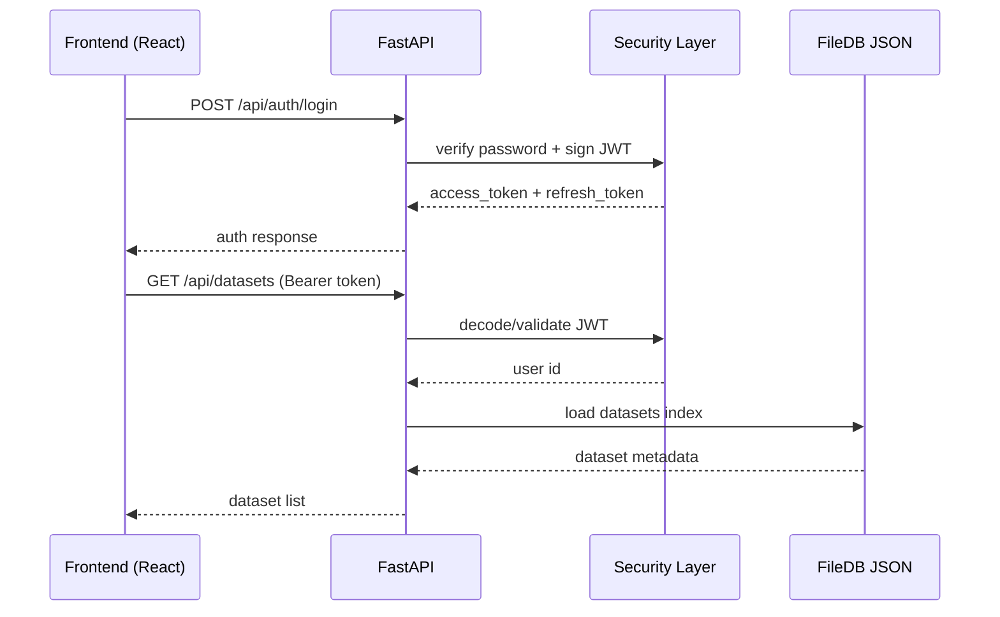

# Enterprise BI Platform

A full-scale, production-ready Business Intelligence platform inspired by Power BI and Tableau — built entirely from scratch with modern technologies, a file-based backend (no external database required), and a rich React frontend with 14+ chart types, AutoML, and AI-powered data analysis.


---

## Table of Contents

1. [What Is Actually Working](#-what-is-actually-working)
2. [Architecture](#-architecture)
3. [Features — Full Detail](#-features--full-detail)
   - [Authentication & Security](#authentication--security)
   - [Dataset Management](#dataset-management)
   - [Query Engine](#query-engine)
   - [Report Builder](#report-builder)
   - [Dashboard System](#dashboard-system)
   - [Machine Learning & AutoML](#machine-learning--automl)
   - [Data Analysis & AI Insights](#data-analysis--ai-insights)
   - [Frontend UI System](#frontend-ui-system)
4. [Project Structure](#-project-structure)
5. [Quick Start](#-quick-start)
6. [API Reference](#-api-reference)
7. [Configuration](#-configuration)
8. [Secure GitHub Push Checklist](#-secure-github-push-checklist)

---

## ✅ What Is Actually Working

| Feature | Status | Notes |
|---|---|---|
| User Registration & Login | ✅ Fully working | JWT + argon2 password hashing |
| Token Refresh & Auth Guard | ✅ Fully working | Stateless, file-based user store |
| Dataset Upload (CSV, Excel, JSON) | ✅ Fully working | Auto-parsed with pandas |
| Dataset Listing & Pagination | ✅ Fully working | Metadata stored in JSON index |
| Dataset Preview & Row Data | ✅ Fully working | Paginated, with schema detection |
| Report Builder (Frontend) | ✅ Frontend complete | Backend stubs; visual editor with Recharts |
| Dashboard Viewer (Frontend) | ✅ Frontend complete | KPI, charts, table widgets rendered |
| ML Training UI (Frontend) | ✅ Frontend complete | Backend stub; connects to H2O-ready API |
| Predictions UI (Frontend) | ✅ Frontend complete | Input forms, results table, SHAP display |
| Explainability UI (Frontend) | ✅ Frontend complete | SHAP bar charts per model version |
| Drift Monitoring UI (Frontend) | ✅ Frontend complete | PSI score display, model health cards |
| Dataset Analysis Page (Frontend) | ✅ Frontend complete | Overview, Quality, Correlation tabs |
| Dataset Comparison (Frontend) | ✅ Frontend complete | Side-by-side stats, distribution, diff |
| Query Engine | ✅ Fully implemented | query.py (mountable) with full pandas filters |
| Analytics Engine | ✅ Fully implemented | analysis.py (mountable) — 4 analysis types |
| H2O AutoML Service | ✅ Fully implemented | model_service.py — 10+ algorithms |
| LLM Insight Generation | ✅ Fully implemented | llm_service.py — SmolLM-135M on CPU |
| Full Reports CRUD | ✅ Fully implemented | reports.py (mountable) — SQLAlchemy |
| Full ML Pipeline CRUD | ✅ Fully implemented | ml.py (mountable) — full scikit-learn |
| Celery Background Tasks | ✅ Configured | Training + Analysis async jobs |
| SQLAlchemy ORM Models | ✅ Fully implemented | User, Dataset, Report, ML, Analysis, Prediction |

> **Note:** The active Docker deployment uses lightweight API stubs (`ml_minimal.py`, `reports_minimal.py`) for zero-dependency startup. The full implementations exist ready to mount.

---

## 🏗 Architecture

```mermaid
flowchart TD
    U[User Browser\nReact 19 + TypeScript] -->|HTTP / Axios| N[Nginx\nSPA + Reverse Proxy]
    N -->|/api| B[FastAPI Backend]

    subgraph API[API Routers]
      A1[/auth]
      A2[/datasets]
      A3[/reports]
      A4[/ml]
      A5[/analysis]
      A6[/query]
    end

    B --> A1
    B --> A2
    B --> A3
    B --> A4
    B --> A5
    B --> A6

    A2 --> F[(JSON/File Storage\nbi-platform-backend/data)]
    A2 --> UP[(Uploads\nbi-platform-backend/uploads)]
    A4 -. optional .-> H2O[(H2O Runtime)]
    B -. optional .-> R[(Redis/Celery)]
    B -. optional .-> P[(PostgreSQL)]
```

### Request Flow (Auth + Data)



**No external database required for core functionality.** Uses file-based JSON storage. Optional PostgreSQL, Redis, and Celery are pre-wired for production scale-out.

---

## 🔍 Features — Full Detail

### Authentication & Security

- **JWT Authentication**: Access tokens (HS256) + refresh tokens with configurable expiry
- **Password Hashing**: argon2 via passlib (with bcrypt-compatibility workaround for 72-byte limit)
- **Auth Guard**: `PrivateRoute` on the frontend redirects unauthenticated users to `/login`
- **Token Persistence**: Stored in `localStorage` as `bi_token` / `bi_refresh_token`
- **Auto-refresh**: 401 interceptor in Axios clears session and redirects to login
- **CORS**: Configurable origins for development (`localhost:5173`, `localhost:3000`) and production
- **Request Timing**: `X-Process-Time` response header via HTTP middleware for performance monitoring
- **Structured Error Handling**: Global exception handler with masked production error messages
- **Input Validation**: Pydantic v2 schema validation on all API request bodies

---

### Dataset Management

- **File Upload**: Multipart upload of `.csv`, `.xlsx`, `.json` files (up to 500 MB)
- **Auto Parsing**: Pandas detects delimiters, encodings, date columns, and types automatically
- **Schema Detection**: Infers column types (`numeric`, `string`, `datetime`, `boolean`) with null %, unique counts, min/max
- **File Storage**: Raw files saved to `/uploads/{user_id}/datasets/`; metadata in `datasets_index.json`; row data in `datasets/{id}.json`
- **Dataset Profile**: Automatic profiling — row/column counts, type breakdown, missing value %, duplicate detection, constant-column detection, per-column stats (mean, median, std, skewness, kurtosis, top-N values), correlation matrix, AI-generated insight
- **Paginated Preview**: Browse any dataset row-by-row with configurable page size
- **Dataset Comparison**: Side-by-side comparison of two datasets — row count ratio, column overlap, size difference, distribution and statistics diff

---

### Query Engine

> Implemented in `app/api/query.py` — fully functional, mountable

- **Advanced Filtering**: `eq`, `neq`, `gt`, `lt`, `gte`, `lte`, `in`, `not_in`, `contains`, `starts_with`, `ends_with`, `is_null`, `is_not_null`, `between`
- **GROUP BY Aggregations**: `count`, `count_distinct`, `sum`, `mean`, `min`, `max` per column grouping
- **Sorting & Pagination**: Multi-column sort, configurable page size, up to 1,000,000 rows
- **Calculated Fields**: Evaluate custom expressions on query results
- **Time Intelligence**: YoY, MoM, QoQ, YTD, MTD comparisons — current period, previous period, absolute change, percent change, trend direction
- **Cross-Filtering**: Filter state coordination across multiple visuals
- **Distinct Values**: Fetch unique column values with optional search for dropdown filters

---

### Report Builder

- **Multi-Page Reports**: Create reports with multiple named pages (tabs)
- **Visual Editor**: Click-to-add bar, line, area, pie/donut, scatter, composed, radar, funnel chart visuals
- **Live Chart Rendering**: Recharts-powered charts rendered from actual query data
- **Configurable Visuals**: Set chart type, X-axis, Y-axis, series, title per visual
- **Canvas Layout**: Position and resize visuals freely on each report page
- **Save & Load**: `PUT /api/reports/{id}` persists full report config including pages and layout
- **Report Cards View**: Search, filter, and manage all saved reports

---

### Dashboard System

- **Dashboard Creation**: Name + optional description; widgets pulled from reports
- **Widget Types**: KPI tile (value + change %), bar chart, line chart, area chart, pie chart, table
- **Dashboard Viewer**: Full-view dashboard renderer with fullscreen mode, share button, edit mode
- **Favorite Toggle**: Star/unstar dashboards directly from the list view
- **Global Filters**: Filter state applied across all widgets in a dashboard (backend-ready schema)
- **Responsive Layout**: Grid-based widget layout adapts to screen size

---

### Machine Learning & AutoML

#### Frontend (Complete)

- **Training Workflow**: Step-by-step UI — select dataset → choose target columns → configure advanced options → start training
- **Advanced Config**: Max runtime, CV folds, max models, auto-stacking toggle, random seed
- **Multi-Target Training**: Select multiple target columns to train separate models simultaneously
- **Model Registry Browser**: Expandable model cards grouped by registry (dataset + target); version list, metrics, production status
- **Promote to Production**: One-click version promotion from staging → production
- **Input-Form Predictions**: Dynamic form auto-generated based on model feature schema; JSON input toggle
- **Results Display**: Prediction result + confidence bar + SHAP waterfall chart
- **Anomaly Detection UI**: Configure contamination %, algorithm (Isolation Forest, LOF, One-Class SVM); results table
- **Clustering UI**: Set number of clusters, algorithm; results with cluster labels
- **Feature Importance UI**: Horizontal bar chart of top features per model
- **Drift Monitoring UI**: Per-model PSI drift score, health status (Healthy / Warning / Critical), trend data

#### Backend Implementation (Fully Written)

- **`ml.py`**: Full scikit-learn pipeline — 12+ algorithms: Random Forest, Gradient Boosting, AdaBoost, Extra Trees, Decision Tree, SVR/SVC, KNN, Linear/Logistic Regression, Ridge, Lasso, ElasticNet, Naive Bayes, SGD
- **`model_service.py`**: H2O AutoML — GLM, DRF, GBM, XGBoost, XRT, Stacked Ensemble; saves best model; full regression/classification metrics + SHAP feature importance
- **`prediction_service.py`**: Loads saved H2O model, runs batch or single inference with confidence intervals
- **Preprocessing**: Missing value imputation (median/mode/drop), LabelEncoder, StandardScaler/MinMaxScaler/RobustScaler, mutual information + F-score feature selection
- **Regression Metrics**: R², RMSE, MAE, MSE, MAPE, residuals plot data, prediction vs actual
- **Classification Metrics**: Accuracy, Precision, Recall, F1, AUC, Log Loss, Confusion Matrix, ROC Curve, PR Curve
- **Celery Tasks**: `training.py` — async model training job with Redis-based status tracking

---

### Data Analysis & AI Insights

> Implemented in `app/api/analysis.py` + `app/services/analysis_service.py` — fully functional, mountable

- **Descriptive Analytics**: Complete statistical summary — mean, median, std, min, max, skewness, kurtosis per column; missing value report; correlation matrix; histogram distributions (20 bins); AI-generated LLM insight
- **Diagnostic Analytics**: Feature importance via target correlation; outlier detection (Isolation Forest, 5% contamination); quartile-based segment analysis
- **Predictive Analytics**: Trains best model on dataset → predicted CV score, best algorithm, feature importances, AI insight
- **Prescriptive Analytics**: Generates actionable business recommendations from predictive results; AI insight
- **Ask-AI**: Freeform natural language question about any dataset answered by local LLM; returns answer + confidence + follow-up questions
- **Async Analysis**: Any analysis type can be queued as a background Celery task, polled by job ID

#### LLM Service (`llm_service.py`)
- Loads `HuggingFaceTB/SmolLM-135M-Instruct` locally on CPU via HuggingFace Transformers
- Analysis-type-specific prompt templates for each of the 4 analytics modes + Q&A
- Outputs up to 512 tokens; returns insight text + confidence score

---

### Frontend UI System

- **Theme System**: Light / Dark mode via `next-themes`; CSS variables controlling all UI colors; sidebar toggle
- **Sidebar**: Collapsible (64px icon-only ↔ 240px full); 5 main nav items with active state; theme toggle and logout at bottom
- **Chart Renderer** (`ChartRenderer.tsx`): Unified Recharts component supporting 14 types — Bar (single + multi-series + stacked), Line, Area (single + multi-series), Pie, Donut, Scatter, Composed (bar + line), Radar, Funnel — with custom tooltips and value formatters (number / currency / percent)
- **Data Table**: Sortable, paginated row viewer for dataset previewing
- **Dataset Comparison**: Two-selector comparison with Overview, Statistics, and Differences tabs
- **Notification System**: Zustand-powered global toast/notification store
- **Form Validation**: `react-hook-form` + `zod` schema validation on all input forms
- **Command Palette**: `cmdk`-powered command palette via Radix UI
- **Responsive Panels**: `react-resizable-panels` for adjustable split-pane layouts
- **Drawer Navigation**: `vaul` drawer for mobile-friendly overlays

---

## 📁 Project Structure

```
Kimi_Agent_Enterprise_BI_Build/
│
├── bi-platform-backend/                    # FastAPI Backend
│   ├── main.py                             # App entry, CORS, middleware, health check
│   ├── requirements.txt                    # All Python dependencies
│   ├── Dockerfile
│   └── app/
│       ├── api/
│       │   ├── __init__.py                 # Active router registration
│       │   ├── auth.py                     # ✅ ACTIVE — JWT auth endpoints
│       │   ├── datasets.py                 # ✅ ACTIVE — Upload, list, preview
│       │   ├── ml_minimal.py               # ✅ ACTIVE — ML stubs (no deps)
│       │   ├── reports_minimal.py          # ✅ ACTIVE — Reports stubs (no deps)
│       │   ├── query.py                    # 📦 Mountable — Full query/filter engine
│       │   ├── analysis.py                 # 📦 Mountable — 4-type analytics + Ask-AI
│       │   ├── ml.py                       # 📦 Mountable — Full scikit-learn ML pipeline
│       │   ├── models.py                   # 📦 Mountable — H2O AutoML + model registry
│       │   ├── predictions.py              # 📦 Mountable — Single + batch prediction
│       │   └── reports.py                  # 📦 Mountable — Full reports + dashboards CRUD
│       ├── core/
│       │   ├── filedb.py                   # ✅ File-based JSON storage (UserDB, DatasetDB)
│       │   ├── security.py                 # ✅ argon2 hashing, JWT create/decode
│       │   ├── config.py                   # Settings via pydantic-settings
│       │   ├── database.py                 # SQLAlchemy async engine (for full APIs)
│       │   ├── redis.py                    # Redis async client
│       │   └── celery_app.py               # Celery broker config + task imports
│       ├── models/                         # SQLAlchemy ORM
│       │   ├── user.py
│       │   ├── dataset.py                  # Dataset, CalculatedField, Measure, Profile, Relationship
│       │   ├── report.py                   # Report, Visual, Dashboard
│       │   ├── analysis.py                 # AnalysisResult
│       │   ├── model_registry.py           # ModelRegistry, ModelVersion, ModelMetrics
│       │   └── prediction.py
│       ├── schemas/                        # Pydantic v2 schemas
│       │   └── auth.py, dataset.py, report.py, ml.py, query.py, analysis.py, prediction.py
│       ├── services/
│       │   ├── dataset_service.py          # File save, pandas load, schema, profile
│       │   ├── analysis_service.py         # 4-type analytics implementation
│       │   ├── llm_service.py              # SmolLM-135M HuggingFace inference
│       │   ├── model_service.py            # H2O AutoML train, metrics, SHAP
│       │   └── prediction_service.py       # H2O model load + inference
│       ├── tasks/
│       │   ├── training.py                 # Celery async model training task
│       │   └── analysis.py                 # Celery async analysis task
│       └── data/                           # Runtime JSON storage
│           ├── users.json
│           ├── datasets_index.json
│           └── datasets/
│
└── app/                                    # React 19 Frontend
    ├── Dockerfile
    ├── nginx.conf
    ├── package.json
    └── src/
        ├── App.tsx                         # Route definitions + PrivateRoute
        ├── api/                            # Axios API clients
        │   ├── client.ts                   # Base Axios instance + interceptors
        │   ├── auth.ts, datasets.ts, reports.ts, query.ts
        │   ├── ml.ts, models.ts, predictions.ts, analysis.ts
        ├── components/
        │   ├── auth/                       # LoginForm, RegisterForm
        │   ├── charts/ChartRenderer.tsx    # 14-type unified chart component
        │   ├── data/DatasetComparison.tsx
        │   ├── layout/                     # Sidebar, Layout, PrivateRoute
        │   └── ml/                         # MLTrainingPanel, MLPredictionPanel
        ├── pages/
        │   ├── HomePage.tsx                # Summary stats + recent items
        │   ├── DashboardPage.tsx           # Workspace overview
        │   ├── DatasetsPage.tsx            # Dataset grid + upload dialog
        │   ├── DataSourcesPage.tsx         # Dataset list + inline preview
        │   ├── DatasetDetailPage.tsx       # Schema, profile, actions
        │   ├── ReportsPage.tsx             # Report list + create
        │   ├── ReportBuilderPage.tsx       # Visual report editor
        │   ├── DashboardsPage.tsx          # Dashboard list + create
        │   ├── DashboardViewPage.tsx       # Dashboard widget renderer
        │   ├── MLPage.tsx                  # Training, Predictions, Models tabs
        │   └── analysis/AnalysisPage.tsx   # Overview, Quality, Correlation tabs
        ├── contexts/
        │   ├── AuthContext.tsx             # Login, register, logout, isAuthenticated
        │   └── ThemeContext.tsx            # next-themes dark/light toggle
        ├── store/index.ts                  # Zustand global notification store
        └── types/index.ts                  # TypeScript type definitions
```

---

## 🚀 Quick Start

### Prerequisites
- Docker and Docker Compose

### Docker Deployment (Recommended)

```bash
# Start — 2 containers: FastAPI backend + Nginx/React frontend
docker-compose up -d --build

# Frontend:      http://localhost
# API Docs:      http://localhost:8000/api/docs
# Health Check:  http://localhost:8000/health

# View logs
docker-compose logs -f

# Stop
docker-compose down
```

Data is automatically stored under `./bi-platform-backend/data/` — no external database needed.

### Local Development

#### Backend

```bash
cd bi-platform-backend
python -m venv venv
venv\Scripts\activate           # Windows
# source venv/bin/activate      # Linux/macOS

pip install -r requirements.txt
uvicorn main:app --reload --host 0.0.0.0 --port 8000
```

#### Frontend

```bash
cd app
npm install
npm run dev
# http://localhost:5173
```

---

## 📖 API Reference

### Authentication

```
POST /api/auth/register     # Create new account → { access_token, refresh_token, user }
POST /api/auth/login        # Login → { access_token, refresh_token, user }
POST /api/auth/refresh      # Refresh token pair
GET  /api/auth/me           # Get current user (Bearer token required)
POST /api/auth/logout       # Client-side token clear
```

### Datasets

```
POST   /api/datasets/upload         # Multipart upload: CSV, XLSX, JSON
GET    /api/datasets                # List user datasets (skip, limit)
GET    /api/datasets/{id}           # Dataset metadata + schema
GET    /api/datasets/{id}/preview   # Paginated row preview (page, page_size)
GET    /api/datasets/{id}/data      # Full row data (skip, limit)
```

### Reports & Dashboards

```
GET    /api/reports                       # List reports
POST   /api/reports                       # Create report
GET    /api/reports/{id}                  # Get report
PUT    /api/reports/{id}                  # Update report (pages, layout, theme)
GET    /api/reports/dashboards/list       # List dashboards
POST   /api/reports/dashboards            # Create dashboard
GET    /api/reports/dashboards/{id}       # Get dashboard
PUT    /api/reports/dashboards/{id}       # Update dashboard (widgets, filters)
```

### Machine Learning

```
POST   /api/ml/train                    # Train AutoML model
GET    /api/ml/models                   # List model registries
GET    /api/ml/training-jobs/{job_id}   # Training job status
POST   /api/ml/predict                  # Run prediction (batch or single)
POST   /api/ml/anomaly-detection        # Detect anomalies
POST   /api/ml/clustering               # Run clustering
POST   /api/ml/feature-importance       # Feature importance scores
POST   /api/ml/compare-datasets         # Compare dataset distributions
DELETE /api/ml/models/{model_id}        # Delete model
```

### Analysis (Mountable — `analysis.py`)

```
POST /api/analysis/descriptive/{id}     # Full descriptive statistics + LLM insight
POST /api/analysis/diagnostic/{id}      # Feature importance + outliers + segments
POST /api/analysis/predictive/{id}      # Train model + CV score + insight
POST /api/analysis/prescriptive/{id}    # Actionable recommendations + insight
POST /api/analysis/ask-ai/{id}          # Freeform NL question answered by LLM
POST /api/analysis/async/{id}           # Queue any analysis as background task
```

### Query Engine (Mountable — `query.py`)

```
POST /api/query/execute                          # Filter + aggregate + sort + paginate
POST /api/query/time-intelligence                # YoY, MoM, QoQ, YTD, MTD
POST /api/query/cross-filter                     # Cross-visual filter state
GET  /api/query/{dataset_id}/distinct/{column}   # Distinct column values
```

### System

```
GET  /health       # { status, version, timestamp, database: "file-based" }
GET  /api/docs     # Swagger UI
GET  /api/redoc    # ReDoc API docs
```

---

## ⚙️ Configuration

### Backend (`app/core/config.py`)

| Variable | Description | Default |
|---|---|---|
| `APP_NAME` | API/service display name | `Enterprise BI & AutoML Platform` |
| `APP_VERSION` | Service version | `1.0.0` |
| `DEBUG` | Debug mode | `False` |
| `ENVIRONMENT` | Runtime environment | `production` |
| `FILE_BASED_DB` | Use JSON file storage | `True` |
| `DATA_DIR` | Path for JSON data files | `./data` |
| `UPLOADS_DIR` | Path for uploaded files | `./uploads` |
| `SECRET_KEY` | JWT signing secret | `sample_dev_secret_change_me_before_production` |
| `JWT_ALGORITHM` | JWT algorithm | `HS256` |
| `ACCESS_TOKEN_EXPIRE_MINUTES` | Access token expiry | `30` |
| `REFRESH_TOKEN_EXPIRE_DAYS` | Refresh token expiry | `7` |
| `MAX_UPLOAD_SIZE_MB` | Upload file size limit | `500` |
| `H2O_PORT` | H2O runtime port | `54321` |
| `H2O_IP` | H2O runtime host | `localhost` |
| `LLM_MODEL_NAME` | Local LLM model ID | `HuggingFaceTB/SmolLM-135M-Instruct` |
| `LLM_MAX_TOKENS` | Max generated tokens | `512` |
| `LLM_TEMPERATURE` | LLM sampling temperature | `0.7` |
| `MAX_QUERY_ROWS` | Max rows per query | `1000000` |
| `QUERY_TIMEOUT_SECONDS` | Query timeout | `300` |
| `CORS_ORIGINS` | Allowed frontend origins | `http://localhost,http://localhost:3000,http://localhost:5173` |
| `LOG_LEVEL` | Log verbosity | `INFO` |

### Frontend

| Variable | Description | Default |
|---|---|---|
| `VITE_API_URL` | Backend API base URL | `http://localhost:8000` |

Environment templates to use before pushing:

- `bi-platform-backend/.env.example`
- `app/.env.example`

---

## 🔒 Security

- argon2 password hashing (Argon2id via passlib)
- HS256 JWT tokens with configurable expiry
- Stateless refresh token flow
- CORS restricted to known origins
- Masked error messages in production
- `X-Process-Time` header for performance auditing
- Pydantic v2 input validation on all endpoints
- File type validation on upload (`.csv`, `.xlsx`, `.json` only)

---

## 🐳 Docker Setup

```yaml
services:
  backend:
    build: ./bi-platform-backend
    ports: ["8000:8000"]
    volumes:
      - ./bi-platform-backend/data:/app/data
      - ./bi-platform-backend/uploads:/app/uploads

  frontend:
    build: ./app
    ports: ["80:80"]
    depends_on: [backend]
```

Two-container setup: FastAPI backend + Nginx serving the React SPA and proxying `/api` to the backend.

---

## ✅ Secure GitHub Push Checklist

Use this checklist before pushing publicly:

1. Keep only sample env files in git:
  - `bi-platform-backend/.env.example`
  - `app/.env.example`
2. Never commit real secrets (`SECRET_KEY`, API keys, production URLs, tokens).
3. Keep local env files ignored by git (already covered in `.gitignore`).
4. If any secret was committed previously, rotate it immediately and clean git history.
5. Verify final staged files before push:

```bash
git status
git diff --staged
```

If `.env` was already tracked in your local history, untrack it once:

```bash
git rm --cached bi-platform-backend/.env
```

Then commit and push:

```bash
git add .
git commit -m "Sanitize config and docs for public GitHub push"
git push origin main
```
